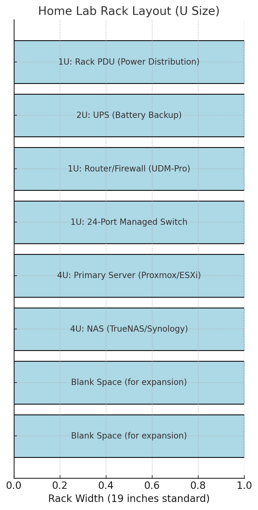

## Rack Layout Diagram

I'll organize it logically based on airflow, cable management, and weight distribution. 

Here is the physical rack layout for your home lab:  

1. **1U: Rack PDU (Power Distribution)** – Powers all rack components.  
2. **2U: UPS (Battery Backup)** – Provides power backup and surge protection.  
3. **1U: Router/Firewall (UDM-Pro)** – Network gateway and firewall.  
4. **1U: 24-Port Managed Switch** – Handles internal network traffic and VLANs.  
5. **4U: Primary Server (Proxmox/ESXi)** – Your main virtualization server.  
6. **4U: NAS (TrueNAS/Synology)** – Storage for media and backups.  
7. **Blank Space** – Reserved for future expansions (GPU server, additional NAS, etc.).  

Here is the diagram of the rack as noted above:

**Reference: Rack Layout**

